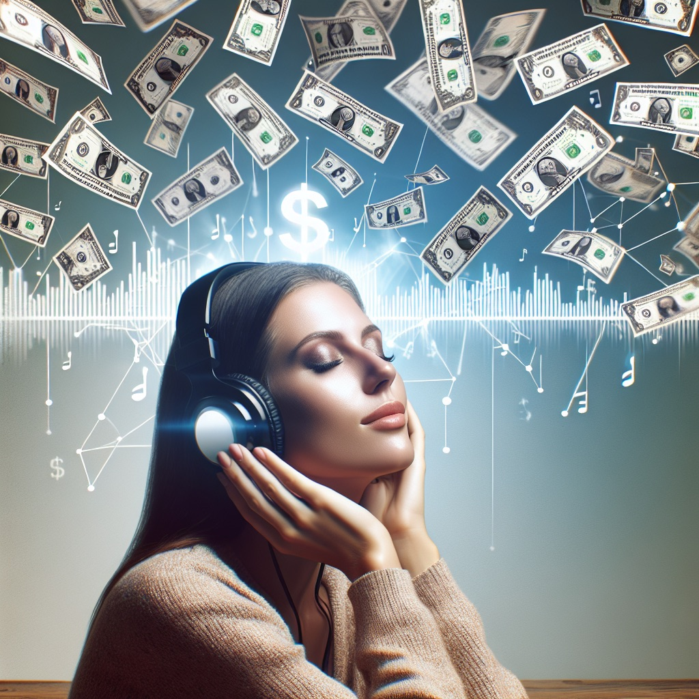

I'm an avid Spotify user. I listen to music pretty much the entire working day. 

That got me thinking... If Spotify pays artists per stream, how many songs do I have to listen before I've "used up" my subscription?

A Spotify or Apple Music subscription costs $10.99 per month.

Apple claims to pay $0.01 per stream^[On average. Actual price is determined by stream share basis. https://artists.apple.com/support/1124-apple-music-insights-royalty-rate]. Spotify doesn't publish official numbers on how much they pay per stream, but estimates range between  $0.00318 and $0.005, so let's take $0.00524 per stream^[Sources: https://www.musicianwave.com/how-much-does-spotify-pay-per-stream/ https://soundcamps.com/spotify-royalties-calculator/ https://producerhive.com/music-marketing-tips/streaming-royalties-breakdown/ https://soundcharts.com/blog/music-streaming-rates-payouts#streaming-payouts-on-spotify-apple-music-google-play-and-deezer https://www.digitalmusicnews.com/2020/08/17/how-much-does-spotify-pay-per-stream-latest/].

## Breaking even
To break-even on my Spotify subscription I need to listen to 2.097 songs.  
`10.99 / 0.00524`

That comes down to almost 70 songs per day. The average song is around 4 minutes long^[https://www.musicianwave.com/how-long-should-a-song-be/], so that means listening to music for 4 hours and 40 minutes each day. That's a lot, but manageable!

Apple Music pays more to artists, so you'll break-even on the subscription after listening to 1099 songs. That's only 33 songs a day.  
`10.99 / 0.01`

## How to bankrupt Apple
What if you keep listening beyond that point? Could you do some serious damage to Apple's or Spotify's business?

At the time of writing, Apple has a cash reserve of $67 billion^[Last updated June, 2024. Latest cash reserve status: https://www.macrotrends.net/stocks/charts/AAPL/apple/cash-on-hand].

At $0.01 per stream, I would have to listen to 6,700,000,000,000 songs to deplete their cash reserves. That's 6.7 trillion songs.  
`67,000,000,000 / 0.01`

There are roughly 230 million songs in the world^[It's actually not clear how many songs there are the world. 230 million is the upper limit. https://www.musicianwave.com/how-many-songs-are-there-in-the-world/], so that means we would need to listen to every song 29,130 times over.  
`6,700,000,000,000 / 230,000,000`

Not only is it impossible to bankrupt Apple or Spotify this way, it's not how they pay artists...

    <h1 class="text-4xl font-bold mb-8 text-center text-indigo-600">Streaming Cost Simulator</h1>
    

        

            <label class="block mb-2 text-sm font-medium text-gray-700">
                Price per stream
            </label>
            

                <input type="range" x-model="pricePerStream" min="0.001" max="0.2" step="0.001" class="p-0 w-full accent-savjeered bg-opacity-10 rounded-lg cursor-pointer">
                
            

        

        

            <label class="block mb-2 text-sm font-medium text-gray-700">
                Monthly subscription price
            </label>
            

                <input type="range" x-model="monthlySubscription" min="4.99" max="19.99" step="0.01" class="p-0 w-full accent-savjeered bg-opacity-10 rounded-lg cursor-pointer">
                
            

        

        

            <label class="block mb-2 text-sm font-medium text-gray-700">
                Songs listened per day
            </label>
            

                <input type="range" x-model="songsPerDay" min="0" max="1000" step="1" class="p-0 w-full accent-savjeered rounded-lg cursor-pointer">
                
            

        

    

    

        <h2 class="mt-0 text-2xl font-bold mb-4 text-savjeered">Results</h2>
        

            

                Cost of streaming:
                $/month
            

            

                <template x-if="damage >= 0">
                    Profit streaming provider:
                </template>
                <template x-if="damage < 0">
                    Loss streaming provider:
                </template>
                $/month
            

            <template x-if="damage < 0">
                

                    You'll bankrupt Apple in:
                     months
                

            </template>
        

    

## How royalties are actually paid
Apple and Spotify don't pay artists per stream.

Instead, they take the total number of streams in a given month and determine what proportion of those are for a given artist. It's called "streamshare"^[https://support.spotify.com/us/artists/article/royalties/] or "stream share basis"^[https://artists.apple.com/support/1124-apple-music-insights-royalty-rate].

If you only listen to 1 artist for the entire month, your subscription fee will still be distributed amongst *all* artists on the platform based on their streaming share. 

If 10% of all streams were Metallica songs, then 10% of my subscription would go to Metallica. Regardless of whether I listened to any of their songs.

I find it strange and unfair for smaller artists. Perhaps it would be more fair to distribute my subscription fee amongst the artists I listened to in a month?
